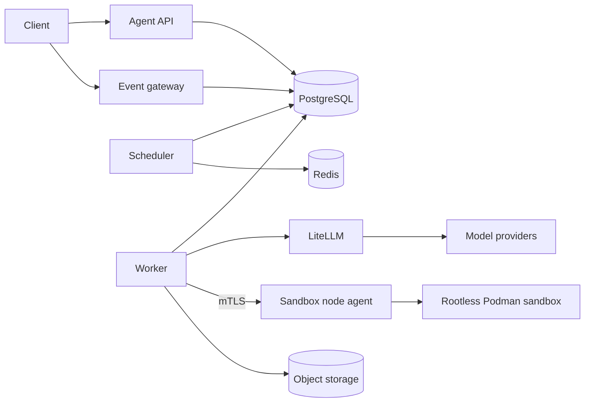

# Platform architecture

The platform has one control plane, one durable execution plane, one model gateway, and one isolated
command boundary.

PostgreSQL is the system of record for sessions, runs, messages, events, task plans, approvals,
checkpoints, queue ownership, worker leases, workspace writer leases, idempotency, gateway policy,
memory, and attribution. Redis is optional coordination/cache infrastructure and never the sole
durable owner of an accepted run.

The `AgentLoop` owns turns, validated tool execution, approval suspension, redaction, limits, event
creation, transcript journaling, and same-attempt duplicate suppression. Durable tool outcomes,
approval decisions, messages, checkpoints, summaries, plans, and memories are restored by the
production worker. The OpenAI Agents SDK is used only behind `ModelGateway`; SDK Runner and SDK
sessions do not own platform orchestration. Workers call model providers only through LiteLLM.
Provider credentials belong only in the LiteLLM workload.

Every untrusted command is argv-only and runs through the sandbox contract. The hardened production
implementation is rootless Podman with a read-only root, one contained worktree mount, no network,
resource ceilings, reduced privileges, explicit cancellation, and targeted cleanup. The Kubernetes
topology uses an mTLS node agent on dedicated rootless-Podman hosts. Only that trusted node boundary
mounts the Podman service socket; Kubernetes workers and sandbox containers never do. Local
security tests exist, but target-cluster kernel, CNI, and runtime behavior still needs live evidence.

See [deployment.md](deployment.md), [reliability.md](reliability.md), and
[evaluation.md](evaluation.md) for operational boundaries and evidence.
