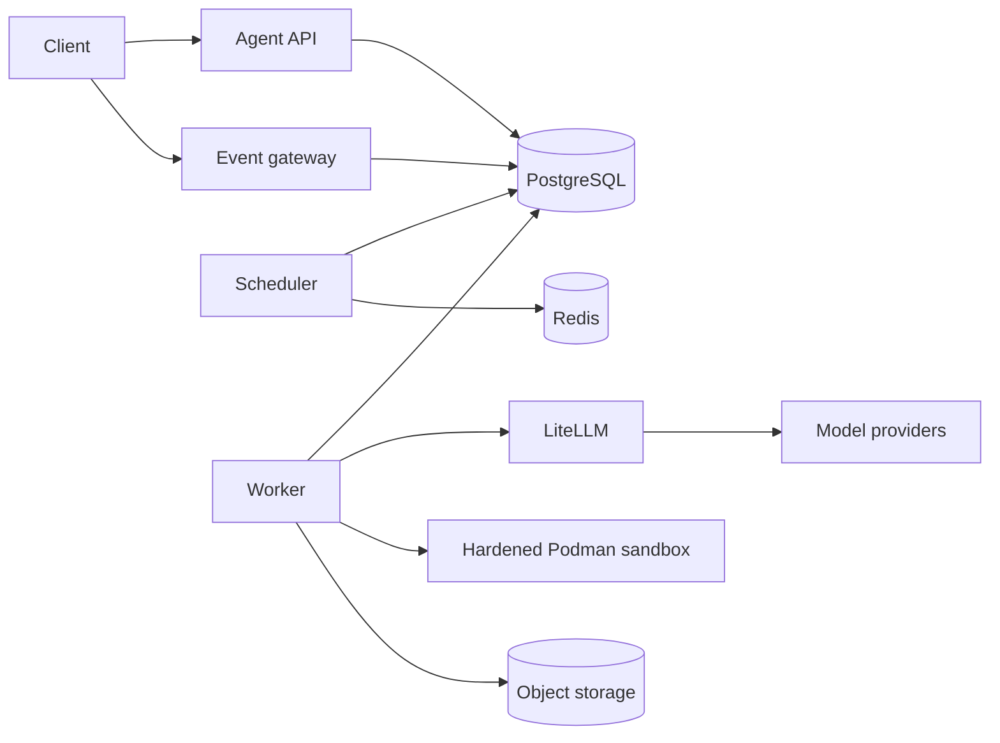

# Platform architecture

The platform has one control plane, one durable execution plane, one model gateway, and one isolated
command boundary.

PostgreSQL is the system of record for sessions, runs, messages, events, task plans, approvals,
checkpoints, queue ownership, worker leases, workspace writer leases, idempotency, gateway policy,
memory, and attribution. Redis is optional coordination/cache infrastructure and never the sole
durable owner of an accepted run.

The `AgentLoop` owns turns, validated tool execution, approval boundaries, redaction, limits, event
creation, and duplicate suppression. The OpenAI Agents SDK is used only behind `ModelGateway`; SDK
Runner and SDK sessions do not own platform orchestration. Workers call model providers only through
LiteLLM. Provider credentials exist only in the LiteLLM workload.

Every untrusted command is argv-only and runs through the sandbox contract. The hardened production
implementation is rootless Podman with a read-only root, one contained worktree mount, no network,
resource ceilings, reduced privileges, explicit cancellation, and targeted cleanup. Kubernetes
workers require a cluster-specific sandbox composition that preserves that contract without mounting
a broad host runtime socket.

See [deployment.md](deployment.md), [reliability.md](reliability.md), and
[evaluation.md](evaluation.md) for operational boundaries and evidence.
